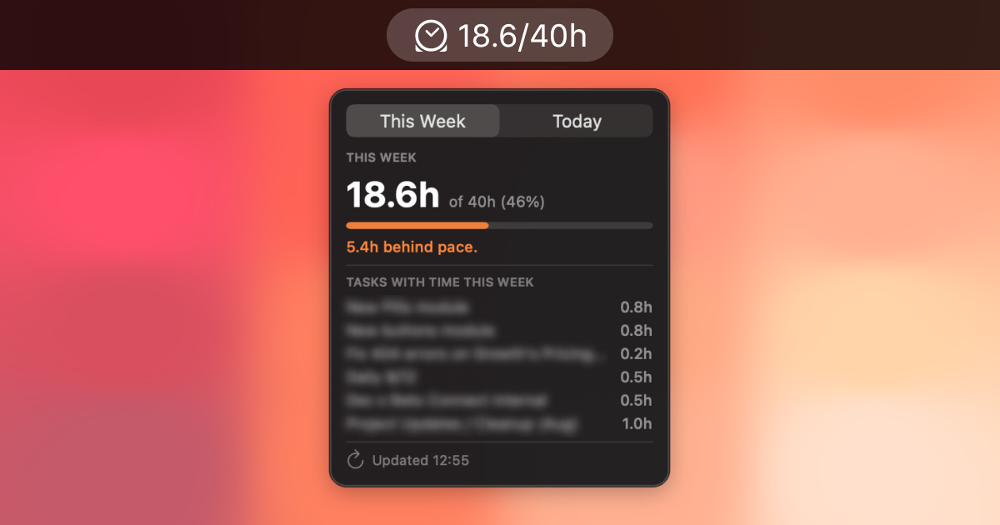

# AsanaStatus (v2.0.2)



A lightweight macOS menu bar app that shows how many hours you've logged in Asana this week against your weekly goal — no browser tab needed.

> Running an older version? Compare the number above to the one under **About AsanaStatus** in the app (right-click the menu bar icon), then re-download `AsanaStatus.app` from this repo if you're behind.

**Menu bar:** `⏱ 22.4/40h`

**Popup:**
- Toggle between **This Week** and **Today**
- Hours logged + % of your goal for whichever period is selected
- Pace indicator (ahead of / behind)
- Breakdown of tasks with time logged, most recent first
- Manual refresh button

## How it works

Asana's own per-user "time logged" total includes every task you tracked time on — even tasks assigned to someone else, or to no one. A simple "my tasks" query misses those. AsanaStatus instead combines Asana's Advanced Search API (`assignee.any` **and** `followers.any`, since Asana auto-follows you on tasks you log time on) with the Time Tracking API, filtering entries by exact date and by you as the author. This matches Asana's own weekly total far more closely than a naive assignee-only query.

## Requirements

- macOS 13 or later, Intel or Apple Silicon (the download is a universal binary)
- Xcode Command Line Tools (`xcode-select --install`)
- An [Asana Personal Access Token](https://app.asana.com/0/developer-console) (Developer Console → Personal access tokens)
- A workspace with Advanced Search enabled (Asana Premium/Business/Enterprise) — required for the task search this app relies on

## Download & run (no build required)

1. Download `AsanaStatus.app` from this repo
2. Move it to your `/Applications` folder
3. Right-click → **Open** → **Open** (required once to bypass Gatekeeper on unsigned apps)
4. Paste your Asana Personal Access Token in the setup window

## Build from source

```bash
git clone https://github.com/bereto-dev/asana-status.git
cd asana-status
make
open AsanaStatus.app
```

## Settings

Right-click the menu bar icon → **Settings…**

- **Personal Access Token** — from the Asana Developer Console
- **Workspace GID** — optional, auto-detected if your account has only one workspace
- **Weekly goal (hours)** — default 40
- **Week resets on** — which day starts your work week
- **Work days per week** — default 5, used to figure out your expected pace (e.g. set it to 4 or 6 if your goal isn't spread Monday to Friday)
- **Language** — English (default) or Español

## First launch security

Because the app isn't notarized (no Apple Developer account needed), macOS will block it the first time. Right-click → **Open** → **Open** to bypass Gatekeeper once.

## Credentials

Your Personal Access Token is stored in the macOS Keychain. Everything else (goal, workspace, week start day, language) is stored in `UserDefaults` on your Mac. Nothing is ever sent anywhere except the Asana API.

## Notifications

AsanaStatus sends a macOS notification the moment you hit your weekly hours goal.

## Changelog

### 2.0.2 — Intel Macs too
The downloadable app was Apple Silicon only, so it would not open on Intel Macs. It is now a universal build that runs on both Intel and Apple Silicon (still macOS 13 or later).

### 2.0.1 — Popup could get stuck open
If a display got connected or disconnected while the popup was open (docking/undocking a laptop, unplugging a monitor), it could end up stuck open with no way to close it. Now any screen change closes it automatically, and clicking anywhere outside the popup closes it too, not just clicking the menu bar icon again.

### 2.0.0 — Today vs. This Week
Added a toggle at the top of the popup to flip between **This Week** and **Today**. It's instant since it reuses the data from your last refresh instead of hitting Asana again.

### 1.2.0 — New look
The menu bar and app icon now use a clock symbol on a red gradient instead of a placeholder emoji.

### 1.1.2 — Tighter popup
The popup used to leave an oddly big gap under the menu bar icon. It now sits right where you'd expect.

### 1.1.1 — Fixed rate limit errors
Weeks with a lot of touched tasks could trip Asana's rate limits and show an error. Fixed by fetching data in smaller batches instead of all at once, with an automatic retry as a backup. Also added a "Check for Updates" menu item that opens this repo.

### 1.1.0 — Configurable work week, real app icon, clearer wording
- Added a proper app icon
- You can now set how many days a week you actually work, since not everyone runs Monday–Friday, and the pace math adjusts to match
- Reworded the pace message so it's clearly about your rhythm, not a confusing comparison against the full weekly goal
- Added Support links (Buy Me a Coffee, devteam.partners) to the About window
- The app version now shows in About, so you can tell at a glance if you're up to date

### 1.0.0 — First release
The original release: hours logged this week vs. your goal, right in the menu bar, no need to open Asana. It also shipped with the fix that makes the numbers actually accurate — Asana counts time logged on tasks assigned to someone else, or to no one, not just tasks assigned to you, so the app searches both instead of only "my tasks."

## Origin

Built by Roberto Pacheco to see at a glance whether he's on track with his hours for the week, without opening Asana.

## Support

If you find AsanaStatus useful, you can buy me a coffee ☕

[](https://buymeacoffee.com/bereto)

Built by [devteam.partners](https://devteam.partners/about-us) 🌐

---

Built with Swift + AppKit. No external dependencies.
