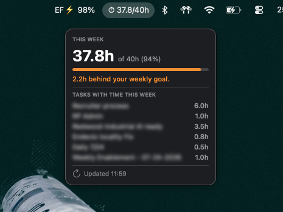

# AsanaStatus (v1.1.2)

A lightweight macOS menu bar app that shows how many hours you've logged in Asana this week against your weekly goal — no browser tab needed.

> Running an older version? Compare the number above to the one under **About AsanaStatus** in the app (right-click the menu bar icon), then re-download `AsanaStatus.app` from this repo if you're behind.

**Menu bar:** `⏱ 22.4/40h`

**Popup:**
- Hours logged this week + % of your weekly goal
- Pace indicator (ahead of / behind your weekly goal)
- Breakdown of tasks with time logged this week, most recent first
- Manual refresh button



## How it works

Asana's own per-user "time logged" total includes every task you tracked time on — even tasks assigned to someone else, or to no one. A simple "my tasks" query misses those. AsanaStatus instead combines Asana's Advanced Search API (`assignee.any` **and** `followers.any`, since Asana auto-follows you on tasks you log time on) with the Time Tracking API, filtering entries by exact date and by you as the author. This matches Asana's own weekly total far more closely than a naive assignee-only query.

## Requirements

- macOS 13 or later
- Xcode Command Line Tools (`xcode-select --install`)
- An [Asana Personal Access Token](https://app.asana.com/0/developer-console) (Developer Console → Personal access tokens)
- A workspace with Advanced Search enabled (Asana Premium/Business/Enterprise) — required for the task search this app relies on

## Download & run (no build required)

1. Download `AsanaStatus.app` from this repo
2. Move it to your `/Applications` folder
3. Right-click → **Open** → **Open** (required once to bypass Gatekeeper on unsigned apps)
4. Paste your Asana Personal Access Token in the setup window

## Build from source

```bash
git clone https://github.com/bereto-dev/asana-status.git
cd asana-status
make
open AsanaStatus.app
```

## Settings

Right-click the menu bar icon → **Settings…**

- **Personal Access Token** — from the Asana Developer Console
- **Workspace GID** — optional, auto-detected if your account has only one workspace
- **Weekly goal (hours)** — default 40
- **Week resets on** — which day starts your work week
- **Work days per week** — default 5, used to figure out your expected pace (e.g. set it to 4 or 6 if your goal isn't spread Monday to Friday)
- **Language** — English (default) or Español

## First launch security

Because the app isn't notarized (no Apple Developer account needed), macOS will block it the first time. Right-click → **Open** → **Open** to bypass Gatekeeper once.

## Credentials

Your Personal Access Token is stored in the macOS Keychain. Everything else (goal, workspace, week start day, language) is stored in `UserDefaults` on your Mac. Nothing is ever sent anywhere except the Asana API.

## Notifications

AsanaStatus sends a macOS notification the moment you hit your weekly hours goal.

## Origin

Built by Roberto Pacheco to see at a glance whether he's on track with his hours for the week, without opening Asana.

## Support

If you find AsanaStatus useful, you can buy me a coffee ☕

[](https://buymeacoffee.com/bereto)

Built by [devteam.partners](https://devteam.partners/about-us) 🌐

---

Built with Swift + AppKit. No external dependencies.
